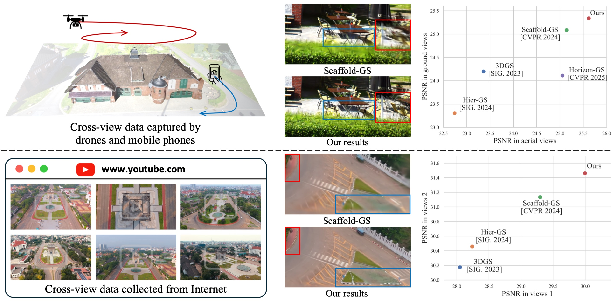

# CrossView-GS: Gaussian Splatting for Cross-view Scene Reconstruction

### [Paper](https://arxiv.org/abs/2501.01695) | [arXiv](https://arxiv.org/abs/2501.01695)

## Overview

<p align="center">

</p>

  Abstract: 3D Gaussian Splatting (3DGS) leverages densely distributed Gaussian primitives for high-quality scene representation and reconstruction. While existing 3DGS methods perform well in scenes with minor view variation, large view changes from cross-view data pose optimization challenges for these methods. To address these issues, we propose a novel Gaussian Splatting method (CrossView-GS) for cross-view scene reconstruction based on multi-branch construction and fusion. Our method independently reconstructs models from different sets of views as multiple independent branches to establish the baselines of Gaussian distribution, providing reliable priors during initialization and densification. Specifically, a gradient-aware regularization strategy is introduced to mitigate smoothing issues caused by significant view disparities. Additionally, a unique Gaussian supplementation strategy is utilized to fuse complementary information of multi-branch into the cross-view model. Extensive experiments on benchmark datasets demonstrate that our method achieves superior performance in novel view synthesis compared to state-of-the-art methods.

## Installation
```
conda env create --file environment.yml
conda activate crossview_gs
```

## Data

The data structure will be organised as follows:

```
data/
├── dataset_name
│   ├── scene1/
│   │   ├── images
│   │   │   ├── IMG_0.jpg
│   │   │   ├── IMG_1.jpg
│   │   │   ├── ...
│   │   ├── sparse/
│   │       └──0/
│   ├── scene2/
│   │   ├── images
│   │   │   ├── IMG_0.jpg
│   │   │   ├── IMG_1.jpg
│   │   │   ├── ...
│   │   ├── sparse/
│   │       └──0/
...
```

## Training

For training a single scene with the base model, modify the path and configurations in ```config/<method>/base_model.yaml``` accordingly and run it:

```
# Train the Dortmund scene for example

python train.py --config config/scaffoldgs/dortmund_aerial.yaml --no_ts
python train.py --config config/scaffoldgs/dortmund_street.yaml --no_ts
python train.py --config config/scaffoldgs/dortmund_init_offset_10_fuseFromInit_lambda1_densify_max.yaml --no_ts
python train.py --config config/scaffoldgs/dortmund_init_offset_10_fuseFromInit_lambda1_densify_max_supply_max_20k.yaml --no_ts

# or sh scripts/dortmund.sh
```

## Evaluation

We keep the manual rendering function with a similar usage of the counterpart in [3D-GS](https://github.com/graphdeco-inria/gaussian-splatting), one can run it by 

```
python render.py -m <path to trained model> # Generate renderings
python metrics.py -m <path to trained model> # Compute error metrics on renderings
```

## Citation

If you find our work helpful, please consider citing:

```bibtex
@article{zhang2025crossview,
  title={CrossView-GS: Cross-view Gaussian Splatting For Large-scale Scene Reconstruction},
  author={Zhang, Chenhao and Cao, Yuanping and Zhang, Lei},
  journal={arXiv preprint arXiv:2501.01695},
  year={2025}
}
```

## LICENSE

Please follow the LICENSE of [3D-GS](https://github.com/graphdeco-inria/gaussian-splatting).

## Acknowledgement

We thank all authors from [3D-GS](https://github.com/graphdeco-inria/gaussian-splatting), [Scaffold-GS](https://github.com/city-super/Scaffold-GS) and [Octree-GS](https://github.com/city-super/Octree-GS) for presenting such an excellent work. We also thank all authors from [gsplat](https://github.com/nerfstudio-project/gsplat) for presenting a generic and efficient Gaussian splatting framework.
